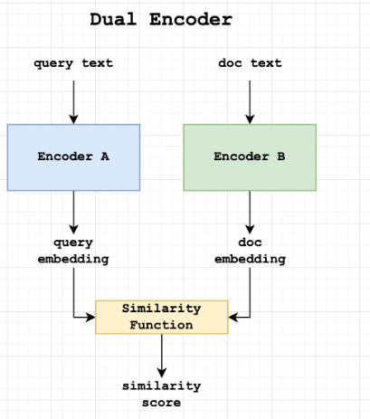
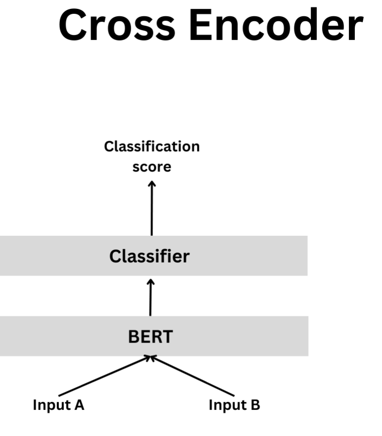

# Retrieval Strategies in RAG

## Table of Contents:

- [Introduction](#introduction)
- [Dataset Info](#dataset-info)
- [Why Retrieval at All?](#why-retrieval-at-all)
- [Classical Sparse Retrieval](#classical-sparse-retrieval)
- [Dense Retrieval](#dense-retrieval)
- [Hybrid Retrieval](hybrid-retrieval)
- [Reranking with Cross Encoders](#reranking-with-cross-encoders)
- [Query Expansion and Self-Query](#query-expansion-and-self-query)
- [Multi-hop Retrieval](#multi-hop-retrieval)
- [Evaluating Retriever in Isolation and In RAG](#evaluating-retriever-in-isolation-and-in-rag)
- [Fine-Tuning Your Own Retriever](#fine-tuning-your-own-retriever)
- [Scaling and Deployment](#scaling-and-deployment)
- [Self-check Quiz](#self-check-quiz)

## 1. Introduction


## 2. Dataset Info

### HotpotQA

A Dataset for Diverse and Explainable Multi-hop Question Answering

**Source:** [HotpotQA](https://huggingface.co/papers/1809.09600) Paper on Hugging Face

HotpotQA is a large-scale question answering dataset designed to support multi-hop reasoning and explainability in QA systems. It consists of $113,000$ question-answer pairs grounded in Wikipedia content. This dataset addresses key limitations in existing QA benchmarks by incorporating the following characteristics:

- **Multi-hop Reasoning:** Each question requires retrieving and synthesizing information from multiple supporting documents to arrive at the correct answer.
- **Diverse Question Types:** The questions span a wide range of topics and are not restricted to predefined knowledge bases or ontologies.
- **Sentence-level Supervision:** Annotated supporting facts are provided at the sentence level, enabling models to learn interpretable reasoning paths and generate explainable predictions.
- **Factoid Comparison Questions:** Includes a novel category of comparison questions that assess a model’s ability to identify and contrast relevant facts.

HotpotQA significantly challenges state-of-the-art QA systems, making it an ideal benchmark for evaluating retrieval and reasoning capabilities in RAG pipelines.

---

## 3. Why Retrieval at All?

### From Closed book to open book

#### Closed-book LLM

- Closed-book means the model answers using only the parametric knowledge stored into its weights.
- No external source is provided at the inference time

**Strengths**

- Fast : Single forward pass
- Works offline

**Weakness**

- Knowledge cutoff (e.g GPT-2 knows nothing beyond 2019)
- Static: Updating facts => retrain or fine-tune
- Hallucinations: Will confidently fabricate plausible-looking but wrong facts
- Context window is wasted repeating facts the model already "knows" but may recall incorrectly 

#### Open-book LLM

- Closed-book LLM + Retriever 
- Inject fresh, task specific snippets (paragraphs, tables, code,..) into the prompt on-the-fly
- Mechanism = Retrieve k pieces of evidence -> Feed them, plus the user query, into the generator

**Benefits**

- Freshness: Index can be updated Independently 
- Compact models can punch above their weight because "knowledge" is off-loaded
- Controllability & Traceability: Can show citations and help in building trust

### Anatomy of minimal RAG Pipeline

- Step 0(Optional): *Query re-writer* reformulates noisy user text into canonical search query
- Step 1: *Retriever* (fast) given the query, find the top-k candidate chunk from a large corpus 
    - *Types*: Sparse(BM25), Dense (DPR/BGE), hybrid, multi-vector (ColBERT)
- Step 2: *Re-ranker(Slow and optional)* Cross encoder scores (query <-> chunk) to reorder top-n with finer semantics
- Step 3: *Prompt Assembler* Select <= context_window tokens, interleave citations, maybe add system instructions
- Step 4: *Generator* Any seq-to-seq or chat-LLM(eg. Llama-3-Instruct, Mixtral-8x7B, GPT-4)
- Step 5: *Post-processor(Optional)* Extract structured answer, highlight sources and detect Hallucinations

**Key Interface Contract:**

- Retriever guarantees: The answer is likely in these k snippets 
- Generator guarantees: Given that atleast one snippet contains the answer, I can synthesize a coherent reply

### Why Not Just Make a Bigger Model?

1. **Cost**
    - GPT-4-class models -> Tens of millions $ to train 
    - ~15 GB VRAM to run at 8-bit
2. **Latency**
    - Embedding lookup in FAISS or a vector DB = a few ms
    - Cheaper than extra transformer layers
3. **Data Privacy & Custom Corpora**
    - Want the model to answer from your PDF collection? Retriever is the only sane path
4. **Explainability**
    - Citations enable audits and regulatory compliance (EU AI Act, HIPPA, ..)

### Evaluation Metrics in RAG System

- Retrieval Level
    - Recall@k (answer ∈ top-k)
    - MRR(Mean Reciprocal Rank (position of first hit))
    - Latency p50/p95 search time

- End-to-end
    - Exact Match (EM)
    - F1 token overlap
    - Helpful-Harmless-Honest(HHH)
    - BLEU/ROUGE for summarization tasks
    - Hallucination Rate (Answer citing no retrieved snippet)

### Hands-on: [Setting Closed-book Baseline](1_hands_on_setting_closed_book_baseline.ipynb)

### Suggested Read

- [Retrieval-Augmented Generation for Knowledge-Intensive NLP Tasks](https://arxiv.org/pdf/2005.11401)
- [Measuring and Narrowing the Compositionality Gap in Language Models](https://arxiv.org/pdf/2210.03350)

---

## 4. Classical Sparse Retrieval

**Outline**
- Understand how term frequency / inverse document frequency (TF-IDF) scoring works
- Derive and implement BM25 - the defacto standard sparse retriever 
- Build and inverted index
- Run top-k search on *HotpotQA* and measure Recall@k
- Compare a BM25-augmented RAG System with closed-book baseline

### Why Sparse

- Each text chunk is encoded as a high dimensional sparse vector
- One dimension per vocabulary term, mostly 0
- Query - Document similarity is computed with a bag-of-words formula
- No Semantics beyond lexical overlap

**Pros**

- Interpretable (You can see which words matched)
- Cheap to build
- Inverted index lives happily on disk
- Sub-millisecond latency over million of docs (e.g. Elasticsearch, Lucene)

**Cons**

- No synonymy or paraphrase handling (Car != Automobile)
- Tokenization matter
    - Misspelling, morphology, multi-word expressions hurt
- Pure lexical overlap is brittle for longer, noisier queries

### The Math Behind TF-IDF to BM25

Understanding the progression from TF-IDF to BM25 is essential in modern information retrieval (IR). Both aim to score how relevant a document is to a query, but BM25 improves upon TF-IDF by correcting some of its key limitations.

**Notation Overview**

Let’s define the notation used in both TF-IDF and BM25:

- $q$ – a query, composed of terms ${t₁, t₂, ..., tₘ}$
- $d$ – a document (or chunk of text)
- $f(t, d)$ – frequency of term $t$ in document d (i.e., term frequency)
- $|d|$ – length of document $d$ in words
- $avgdl$ – average document length in the collection
- $N$ – total number of documents in the corpus
- $n(t)$ – number of documents that contain term $t$

#### Classic TF-IDF (Cosine-Based)

The TF-IDF score reflects how important a word is to a document, relative to a collection of documents. The simplest formulation is:

*Term Weighting:*

$$
weight(t,d) = f(t,d).\log(\frac{N}{n(t)})
$$

*Document Score:*

$$
score(q,d) = \sum_{t \epsilon q}weight(t,d)
$$

This means we sum the importance (weight) of each query term $t$ in the document.

**Limitations of Classic TF-IDF**

- Linear term frequency(TF): The more a term appears, the higher its score - even if it's spammy
- No length normalization: Long documents naturally have more terms, unfairly boosting their scores
- No Probabilistic basis: TF-IDF does not explicitly model how likely a term is to appear in relevant vs non-relevant documents

#### Okapi BM25

BM25 (Best Matching 25) is a ranking function built on a probabilistic retrieval framework. It fizes TF-IDF's flaws by introducing term frequency saturation and document length normalization.

*Scoring Function*

$$
score(q, d) = \sum_{t \epsilon q}IDF(t) . \frac{f(t,d).(k_1 + 1)}{f(t,d)+k_1 . (1 - b + b . \frac{|d|}{avgdl})}
$$

where

$$IDF(t) = \log((N - n(t) + 0.5) / (n(t)+0.5) + 1)$$

$$k_1 \epsilon [1.2, 2.0]$$ controls TF saturation 

$$b \epsilon [0, 1]$$ controls length normalization (b = 0 -> none; b=1 -> full)

Most IR systems default to $k_1=1.5, b=0.75$

**Why BM25 usually wins over vanilla TF-IDF**

- TF saturation stops spammy word stuffing
- Length normalization prevents long docs dominating 
- Probabilistic IDF is numerically stabler for rare and common terms 

### Building an Inverted Index 

Inverted index = hashmap term -> posting list [(doc_id, f(t, d)),..]

**At query time:**

1. Tokenise query -> terms 
2. For each term, pull posting list 
3. Union doc_ids, compute BM25 score, keep top-k

**Complexities**

- Build time: $O(total tokens)$
- Query time: O(#unique query terms $\dot$ avg posting length)

With proper caching and compression (Delta + VarByte), Lucene handles $>10^9$ docs

### Scaling beyond RAM

- **Elasticsearch/OpenSearch:** BM25 implemented as Lucene Similarity. Horizontal sharding + replicas > 1Bn docs per cluster is common
- **Index size heuristic:** Compressed posting 
- **Query latency tuning:** Pre-computed term statistics, field norm caching, in-memory hot shard tier

### Hands-on: [Sparse retrieval - BM25 on HotpotQA](2_sparse_retrieval_bm25_on_hotpotqa.ipynb)

### Suggested Read

- [The Probabilistic Relevance Framework: BM25 and Beyond](https://www.staff.city.ac.uk/~sbrp622/papers/foundations_bm25_review.pdf1)
- [Introduction to Information Retrieval](https://nlp.stanford.edu/IR-book/information-retrieval-book.html)


---

## 5. Dense Retrieval

**Outline**

- Lexical-match retrieval vs Dense semantic retrieval 
- Understanding the Bi-Encoder architecture - Contrastive Training and Similarity Scoring
- Build, store and query a FAISS index (Exact and Approximate)
- Measure quality, speed and memory vs BM25 system
- Tunable parameters: Model choice, pooling, quantization, ANN parameters

### Issues with Sparse retrieval

- **Synonymy and Morphology:** Unable to handle different word forms ("run" vs "running") or synonyms efficiently 
- **Long Multi-hop Queries:** Often retrieves insufficient data for complex, multi-step questions
- **Rare Entities:** Struggle with terms or entries thar are rare or unseen in the corpus
- **Context and Semantics:** Fails to understand the broader context and semantics of queries
- **Positional Context:** Lack sensitivity to the positional importance importance of terms within documents

These limitations point directly at dense semantic embeddings.

### Why Dense Retrieval?

- Problem 1: Vocabulary mismatch
    - "car" vs "automobile", "COVID" vs "Coronavirus", BM25 cannot match zero overlap tokens
- Problem 2: Semantic Ranking
    - Even if overlap exists, BM25 can not tell "Apollo 11 commander" from "Apollo 11 launch date"

Neural sentence embeddings map texts into $$R^d$$ such that semantically related pairs have high dot / cosine similarity. This helps in improving recall by significant margin wrt BM25 retrieval Methodology.

### Bi-Encoder Fundamentals 

Bi-encoders are neural network models used for tasks like retrieval and reranking by encoding both queries and documents into fixed-length vectors and then calculating their similarity using dot product or cosine similarity.

**Architecture**

<table align='center'>
  <tr>
    <td align="center">
      
    </td>
  </tr>
  <tr>
    <td align="center"> Bi-Encoder Architecture </td>
  </tr>
</table>

*Components*

- Query Encoder and Document Encoder
    - Both the query and document are passed through their respective encoders
    - In many implementations, the weights are tied, meaning the same transformer model is used to encode both the query and the passage 
- Output
    - Each encoder output a single fixed-length vector for the query and document, typically with a dimensionality of $786$ for models like BERT-base
- Relevance Score
    - The relevance score is computed using a dot product or cosine similarity between the encoded vectors of the query and document 

**Training Signal:**

    - Objective : Bring together positives, and push away negatives
    - The loss function used is Multiple-Negative Ranking, which for a mini-batch of size(b) is calculated as:
        - $$Sim = \frac{q_{i} \dot d_{j}}{\tau}$$
        - Apply softmax over $j$
        - Loss: $$\text{Loss} = - \text{mean} \log{p(j=i)}$$


**Similarity Choice**

- Cosine Similarity: Measures similarity by computing the cosine angle between two vectors. It is equivalent to a dot product between L2-normalized vectors
- Inner Product Similarity: Used if vectors are centered during training, without normalization

**Pooling**

- [CLS] Token: By default, the [CLS] token's representation is used for encoding
- Mean Pooling: Averaging the token representations across the sequence. This can slightly improve the robustness of the model by capturing more contextual information

### ANN Search with FAISS

FAISS or Facebook AI Similarity Search, is a library for efficient similarity search and clustering of dense vectors. It is widely used in scenarios where there is a need to search through vast quantity of data very quickly.

**Exact search**

- Techniques: `IndexFlatIP` (Inner Product) / `IndexFlatL2` (Euclidean Distance)
    - Computational Requirement: Involves one matrix multiplication 
    - Memory Requirement: RAM usages is proportional to `#docs x embedding dim x size of each float`

**Approximate Search**
- `IVF (Inverted File Index)`: Uses a coarse quantizer followed by inverted lists of efficient search 
    - Advantages: Significant speed gains when working with large datasets (>= 1M Documents)

- `HNSW(Hierarchical Navigable Small World Graph)`: Employs a graph-based approach 
    - Advantages: Offers strong recall and low search latency and relatively easy to fine-tune

**Quantization**

- `float16 Quantization`
    - Objective: Reduces RAM usage by Half
    - FAISS Support: FAISS can handle `float16` to optimize memory usages

- `Product Quantization`
    - Objective: Compresses vector data, typically reducing size by factor of 8-16
    - Trade-off: This compression comes at the cost of reduced recall accuracy 

### Hands-on: [Dense Passage Retrieval](3_dense_retrieval_on_hotpotqa.ipynb)

### Strength over BM25

- Big jump in synonym / paraphrase questions ("father", "dad", "parent of")
- Longer, complex queries tolerated 
- Language agnostic: Multilingual checkpoints allow bi-encoder models to perform cross-lingual question answering.

### Limitation of dense retrieval

- Proper names unseen in pre-training - Rare entities may collapse 
- Computation cost when building index (transformer pass over whole corpus)
- Exact phrase constraints ("start with", "spelling") worse than BM25

### Suggested Read

- [Dense Passage Retrieval for Open-Domain Question Answering](https://arxiv.org/pdf/2004.04906)
- [Sentence-BERT: Sentence Embeddings using Siamese BERT-Networks](https://arxiv.org/abs/1908.10084)
- [FAISS(Facebook AI Similarity Search)](https://ai.meta.com/tools/faiss/)

---

## 6. Hybrid Retrieval

**Combining sparse & dense in one engine**

**Outline**

- Understand why sparse and dense signals are complementary
- Learn three practical fusion methods
    - Score-level weighted sum ($\alpha\text{-fusion}$)
    - Reciprocal Rank Fusion(RRF)
    - Union-then-rerank(candidate pooling)
- Measure recall Exact Match/F1, latency and context-token cost
- Acquire heuristic for choosing fusion parameters in production 

### Complementarity Intuition

**Sparse strengths:**
- Exact surface forms
- Numbers
- Rare proper nouns

**Dense strengths:**
- Synonyms
- Morphology
- Paraphrases
- Cross-lingual

**Illustrative failure modes**

```
Questions: "Which automobile company ...?"
- BM25 misses because "automobile" rarely appears
- Dense gets semantic match "car manufacturer"

Opposite: "What is the ISBN 978-0-19-283398-3 book title?"
- Dense collapse numeric token
- BM25 matches its verbatim

```

Therefore combining both techniques into some kind of hybrid setting will yield a robust retriever.

### Practical Fusion Methods

#### Score-Level Fusion ($\alpha \text{Fusion}$)

We want a unified score $S(d, q)$

Normalize each score to comparable scale 
- BM25 range is ~0-15 for short passage
- $\text{Cosine similarity} \epsilon [0,1]$ (after L2-norm)

**Min-max normalization per query**

- Cheap and Robust

**Mathematical expression**

$$\text{BM25`} = \frac{(s_sparse - min_sparse)}{(max_space - min_space)}$$

$$\text{Dense`} = \frac{(s_dense - min_dense)}{(max_dense - min_dense)}$$

**Final Score**

$$S = \alpha \dot BM25` + (1-\alpha) \dot Dense` ,$$

$$\alpha \to [0, 1]$$

**Pros:**
- Single pass over candidates
- Tunable $\alpha$

**Cons:**
- Needs both score from the same candidates set

#### Reciprocal Rank Fusion (RRF)

- Rank Level 

$$RRF_score(d) = \sum \test{lists}\frac{1}{k + rank_d, l}$$

Usually $k = 60$ (set so $\frac{1}{k+1} ~ 0.016$)

Only needs the rank, not raw scores 

**Benefits**

- Insensitive to scale
- Simple to implement
- Strong empirical results


#### Candidate Pooling Strategy 

- Retrieve top-m_sparse (e.g. 50) from BM25
- Retrieve top-m_dense from HNSW
- Union -> $N \le m_sparse + m_dense$ candidates
- Apply fusion ($\alpha-fusion$ or RRF) to re-rank
- Keep top-k_final (1-5) for the LLM

$m >> k_final$ ensures both signals have a chance; N is still tiny ($<=100$), so per query cost is negligible.

### When Hybrid Hurts

- Very large corpora (>> 10 M docs) where dense recall already $>90%$
- Extra sparse looks-ups can be wasted latency 
- Non-lexical corpora (images, code) where sparse signal is weak

Note: Fallback heuristics - run hybrid only if dense similarity $max < \tau$

### Hands-on: [Hybrid Retrieval](4_hybrid_retrieval_on_hotpotqa.ipynb)


### Suggested Read

- [Combining Document Representations for Known-Item Search](https://www.cs.cmu.edu/~callan/Papers/sigir03-pto.pdf)
- [The Curse of Dense Low-Dimensional Information Retrieval for Large Index Sizes](https://arxiv.org/abs/2012.14210)
- [What is hybrid search?](https://www.elastic.co/what-is/hybrid-search)


---

## 7. Re-ranking with Cross Encoders

**Outline**

- Understanding why a high-recall retriever is not enough
- Cross-encoder architecture and how it differs from Bi-encoders
- Adding a re-ranker stage to hybrid retriever
- Measure the gain in answer correctness vs added latency/cost
- Practical deployment tricks
    - Batching
    - Early-exit
    - Distillation 

### Why Rerank?

- Retriever gives us recall: "The answer is somewhere in top-k"
- Generator is sensitive to the order of window of those passage  - best evidence should sit earliest
- Dense + Sparse fusion still uses bag-of-vector similarity, which ignores query passage cross-token interactions("not", word order, coreference)

**Cross-Encoders inspect both texts jointly (query, passage) -> dramatically better top-1 precision**

### Cross-encoder Architecture 

<table align='center'>
  <tr>
    <td align="center">
      
    </td>
  </tr>
  <tr>
    <td align="center"> Cross-Encoder Architecture </td>
  </tr>
</table>

**Process Variables:**

- Input: "[CLS] query [SEP] passage [SEP]"
- Backbone: Full transformer (BERT, MiniLM, E5-mistral etc.)
- Scoring: Regression head on CLS token -> relevance $\epsilon R$

**Key contrasts with Bi-Encoder:**

- Single forward pass per (q, d) pair ($\theta$ parameters not shared across docs in batch)
- Computes rich token-level interaction - capture negation, phrase order, numerics
- O(cost = O(#pairs)) vs O(1) for dot-product - so we use it only on a small candidate set (<=100)

### Training Paradigms 

- Pointwise (MS-MACRO): predict 0/1 relevance
- Pairwise (Margin ranking): Prefer positive over negative 
- Listwise: Softmax over list (rare)

### Popular Checkpoints

- `cross-encoder/ms-macro-MiniLM-L-12-v2` 
    - 65M Parameters, 768D
- `cross-encoder/ms-macro-MiniLM-L-6-v2` 
    - 33M Parameters, 6-layers, faster
- `cross-encoder/mteb-mpnet-base-v2` 
    - QA + multi-task

**API is identical to SentenceTransformers `CrossEncoder`**

### Hands-on: [Retrieval_and_Reranking](5_retrieval_and_reranking_on_hotpotqa.ipynb)

### Advance Corner - RAG-Aware Reranking

- Add LMM score as extra feature: After generation, ask model "WHich citation supports the answer?" and boost its picks
- Multi-objective rerank: $\alpha \dot {relevance}$ + $\beta \dot {diversity}$ to avoid redundant passage

### Suggested Read

- [Passage Re-ranking with BERT](https://arxiv.org/pdf/1901.04085)
- [Understanding BERT Rankers Under Distillation](https://arxiv.org/pdf/2007.11088)
- [The Expando-Mono-Duo Design Pattern for Text Ranking with Pretrained Sequence-to-Sequence Models](https://arxiv.org/pdf/2101.05667)

---

## 8. Query Expansion and Self-Query

**Outline**
- Classic information-retrieval idea of query expansion/pseudo-relevance feedback(PRF) and how it boosts recall
- Learn two modern twists that work well with RAG
    - Rocchio-style PRF for sparse and dense indexes
    - LLM-based "Self Query Retrieval"
- Implementation both techniques on the top of our Hybrid + Rerank pipeline
- Acquire heuristic for deciding when to expand, how many expansions to keep, and how to merge the results

### Why Expand the query?

Even the 2-stage system may fail when the original words too short, Ambiguous or lack synonyms found in the answer passage.

**Example:**

Q. Which drummer of Nirvana wrote Smells like Teen Spirit?
- None of the terms "drummer" or "wrote" appear in the correct paragraph
    - BM25 misses
- Dense retriever might catch "drummer <-> musician" but still ranks the right paragraph at bottom 

*Adding expansion terms "Dave Grohi", "songwriter", "band" raised the doc to top 5*

**Expansion adds missing "hints" that align the query vector with passage vectors**

### Classic PRF - Rocchio Algorithm

**Pipeline:**

- Run initial retrieval -> top $m_0$ passage (e.g. $m_0=5$)
- Assume they are mostly relevant ("pseudo relevance")
- Extract terms with high TF-IDF in those passage, keep top k terms
- Re-issue a new query $q' = \alpha \dot q_orig + \beta \dot \sum {relevant_term_vectors}$
- In BM25 space this means appending terms with weights $\beta$
-  In dense space it means adding the mean passage embeddings

**Rocchio equation(vector form)**

$$q' = \alpha \dot q + \frac{\beta}{m} \sum{d_i (rel)} - \frac{\gamma}{n} \sum {d_j}(non-rel)$$

We usually set $\gamma = 0$ for pseudo feedback(no known non-relevant docs)

Typical hyper-parameters
- $\alpha = 1.0$
- $\beta = 0.8$
- $k_terms ~ 10$
- $m = l 3-5 passages$

### LLM self-query retrieval (ReAct-style)

Prompt the generator itself(or a small "assistant" LLM) to:

- Rewrite/decompose the question
- Generate multiple keyword-style queries and entity mentions
- Optionally tag each with filters (date, entity-type) for structured search (Databricks "Self-Query Retriever" 2023)

**Example Prompt**

System: You are a search expert.

User: Question: "Which drummer of Nirvana wrote smells like Teen Sprit?"
Please produce 3 keyword search queries that, if issued to Wikipedia, would find passages containing the answer. Separate each on a new line.

**Model Outputs**

- "Smells like Teen Spirit songwriter"
- "Dave Grohl Nirvana drummer"
- "Who wrote the Nirvana song Smells Like Teen Spirit"

We then embed / BM25s-search each query Independently, union the hits, and merge with RRF or $\alpha-fusion$.

### LLM vs Rocchio

- Handles paraphrase, multi-hop decomposition
- Can invent entities not seen in the text (creative)
- Adding LLM adds one extra generation call per user query (cost & latency)
- May hallucinate useless expansions

### Design Heuristics

- When to trigger PRF?
    - If top-k BM25 or dense similarity < $\tau$ (uncertain)
    - If query <= 3 token (too short)

- How many expansions?
    - 2-3 LLM rewrites usually enough more add noise

- Merging strategy 
    - RRF over (original + expansions) is robust with no tuning

- Avoid topic drift 
    - Keep expansion terms/queries only if they contain atleast one original noun or proper noun
    - For LLM method add instruction "Keep all key entities from the question"

### Hands-on: [Query Expansion and Self-Query](5_query_expansion_and_self_query_on_hotpotqa.ipynb)

### Suggested Read

- [Query Expansion using Lexical-Semantic Relations](https://link.springer.com/chapter/10.1007/978-1-4471-2099-5_7)
- [Self-Retrieval: End-to-End Information Retrieval with One Large Language Model](https://arxiv.org/html/2403.00801v2)

---

## 9. Multi-hop Retrieval


**Outline**

- Recognise questions that require combining evidence from several sources ("bridge", "comparison", "intersection")
- Understand the main patterns of multi-hop retrieval 
    - Sequential hops
    - Query Decomposition 
    - Explicit knowledge-graphs
- New evaluation metrics
    - Joint-Recall
    - Path Accuracy 
    - EM/F1
- Engineering tradeoff
    - Latency 
    - Token budget
    - Error cascades

### Why Multi-Hop

HotpotQA questions types (provided in metadata)
- bridge: Need 2 docs linked by a shared entity
- comparison: Must contrast numeric / categorical facts from 2 docs
- factoid: Single document suffices

**Large head-room if we can chain the retrieval**

### Common Patterns

#### Sequential Hops (Entity Chaining)

This pattern involves step by step approach where each retrieval informs the next. It's particularly effective when the answer requires connecting multiple pieces of information through intermediate entities.

**Process:**

1. Hop 1: Retrieve a document related to entity A
2. Extract Entity B: From the retrieved document, identify a new entity (Entity B) that's pertinent to the original question
3. Hop 2: Formulate a new query combining Entity B with the original question's context and retrieve relevant information

**Example**

Question: "What is the capita of the country where the inventor of the telephone was born?"

- Hop 1: Identify the inventor of telephone (Alexander Graham Bell) and determine his birthplace (Scotland)
- Hop 2: Find the capital of Scotland, which is Edinburgh

**Advantages**

- Straightforward to implement
- Effective for questions requiring a linear chain of reasoning 

#### Query Decomposition

This approach breaks down a complex question into simpler sub-questions, each of which can be answered independently. The individual answers are the combined to form the final answer.

**Process**

- Decompose the original question into multiple sub-questions
- Retrieve information and answer each question separately 
- Combine the answers to address the original complex question 

**Example**

Question: "Which film came out first, The Love Route or Engal Aasan?"

- Sub-question 1: "When was The Love Route released?"
- Sub-question 1: "When was The Engal Aasan released?"
- Final Step: Compare the release dates to determine which film came out first

**Advantages**

- Allows parallel processing of sub-questions
- Enhances interpretability by providing clear reasoning steps

**Considerations**

- Requires effective decomposition strategies 
- Combining answers may introduce complexity


#### Graph Walk (Knowledge Graph Traversal)

This method constructs a graph (e.g. knowledge graph) where nodes represent entities or concepts, and edge represent relationships. The system then traverses this graph to find the answer.

**Process**

- Build a graph with nodes and edges representing entities and their relationships
- Use algorithm (like best-first search) guided by neural scoring to traverse the graph
- Identify the path that leads to the answer

**Example**

Question: "Who is the spouse of the composer of 'Modern Times'?"

- Graph Construction: Nodes for 'Modern Times', its composer (Charlie Chaplin), and his spouse (Oona O'Neil)
- Traversal: Navigate from 'Modern Times' to 'Charlie Chaplin' then to Oona O'Neil

**Advantages**

- Captures complex relationships and reasoning paths
- Effective for questions requiring multiple relational hop

**Considerations**

- Requires a well-constructed and comprehensive knowledge graph
- Implementation can be complex and resource-intensive

#### Which Pattern is Better?

Sequential Hops (Entity Chaining) offers a balance between simplicity and effectiveness. 

It is suitable when:
- The question involves a clear sequence of related entities 
- A lightweight solution is preferred without need of complex graph structure
- Quick implementation and scalability is desired 

#### Sequential-Hop Pipeline

User question $q_0$

👇

Hop 1 Retriever (Hybrid + rerank)

👇

- doc $d_1$
- Extract "anchor" tokens: title of $d_1$, high-TF noun-phrases or ask an LLM.
- Compose new query $q_1 = f(q_0, anchors)$

👇

- Hop 2 retriever (dense/BM25/hybrid)

👇

- Doc $d_2$

👇

Prompt Assembler 

- Context = $d_1 + d_2$

👇

Generator -> Answer + Citations

#### Design choices

- How many docs to keep from each hop? 
    - 1-2 sufficient
    - More = Token waste
- Stop Criterion
    - If Hop 1 already contains explicit answer span, skip hop 2
- Error containment
    - If Hop 1 is wrong, system should fall back to original single-hop context


### Evaluation Glossary

- Hop 1 recall: P(answer in any doc retrieved at hop 1)
- Joint Recall@k: P(answer in union of hop 1 & hop 2 top-k_final)
- Path Accuracy: P(Both required docs present and generator cites both)


### Latency and Token Budget

Baseline (single hop) -> 20 doc embeddings + rerank + LLM generation

Two hop adds:
- Extra hybrid search + rerank
- Anchor extraction
    - If it is heuristic then no latency
    - For LLM latency will be higher
- Extra passages in prompt

### Failure Mode and Mitigations

1. Wrong Hop-1: Cascade failure 
    - Solution: If cross-encoder score < $\tau$, skip hop-1 and keep single-hop
2. Anchor too generic ("he", "it") -> useless Hop-2
    - Solution: Filter anchors by POS + stop-list
3. Context bloat -> Higher LLM cost
    - Solution: Clipping - keep 2 hops x top-2 passages
    - Balance with earlier EM experience

### Alternatives and Extensions

- Decomposition-first: Let LLM output two sub-queries the search each separately (works well for comparison)
- Graph walk: Pre-index wikipedia hyperlink graph, from Hop-1 title follow out edges limited to 2-hops, score those pages with dense similarity 
- Iterative RAG: Generate partial answer, detect missing slot and retrieved again

### Hands-on: [Multi-hop Retrieval](7_multihop_retrieval_on_hotpotqa.ipynb)

### Suggested Read

- [Answering Complex Open-domain Questions Through Iterative Query Generation](https://arxiv.org/pdf/1910.07000)
- [Improving Multi-step Reasoning for LLMs with Deliberative Planning](https://arxiv.org/html/2406.14283v3)
- [ReAct: Synergizing Reasoning and Acting in Language Models](https://arxiv.org/pdf/2210.03629)


---

## 10. Evaluating Retriever in Isolation and In RAG

**Outline**
- Catalogue the metrics that matter at three layers:
    - Pure retrieval 
    - Prompt-level context
    - Final Generation
- Diagnose "where the error live" with simple taxonomy
- Study correlation between recall@k and downstream EM/F1
- Practical recipe for monitoring latency, token-budget efficiency and hallucination rate in production

### Three Evaluation Rate

#### Layer 0: Retriever Only

- Recall@K: P(answer-span appears in any of top-k passage)
- Precision@K, MRR, MAP, NDCG(ranking quality)
- Latency p50/p95, cache hit-rate
- Memory / index size

#### Layer 1: Prompt/Context

- Context Efficiency : Token used / ccontext _window
- Redundancy: % of duplicate info across passage
- Evidence order: Rank position of the first passage that contains the answer

#### Layer 2: Generation

- Exact Match, F1 
- Faithfulness / Citation Accuracy
    - % of answer whose quoted evidence really supports the claims
- Hallucination rate
    - answer != gold ^ no of retrieved passage contains it
- Helpful-Harmless-Honest scores (Human or LLM Judge)
- End to End latency
- Budget

### Error Taxonomy

- E0: Retrieval Miss: Answer absent from all top-k passages
- E1: Retrieval Hit but rank > k_prompt (truncated from context)
- E2: Evidence present but generator outputs wrong or partial answer
- E3: Generator hallucinations contradicting evidence in the context
- E4: Answer correct but citation/formatting mismatch (metric penalize)

Multihop and Query expansion might cause E0/E1, better prompt can help in mitigating E2/E3.

### Auxiliary monitors in production

- Context Token Ratio (ctx / window)
    - The proportion of tokens used in the context relative to model's maximum input window
    - A higher ratio indicates more context utilization, which can lead to increased computational costs and a higher risk of input truncation 
    - Managing the ratio helps balance performance with resource efficiency 

- Good Evidence First (% answers in top-2)
    - The percentage of answers where relevant evidence appears within top 2 retrieved documents
    - Especially crucial for models with limited context windows

- Average Passages per Answer
    - The average number of text passages retrieved to formulate an answer
    - Balancing the number of passages is essential, too few may omit necessary information, while too many can increase processing time and costs without any significant quality gains

- Hallucination Rate (Wrong & No Cite)
    - The frequency at which the model generates incorrect information without proper citations 
    - Critical reliability metric

- p95 Retrieval Latency
    - The 95th percentile of the time taken to retrieve information, meaning 95% of retrieval occur within this time frame
    - Maintaining this latency below 30ms is vital for responsive chat user experience.\

- Generator Time-to-First-Token (TTFT)
    - The duration between a user's request and the generation of the first token in the model's response
    - A lower TTFT enhances perceived responsiveness

### Some empirical results/thresholds

- If recall@5 < 80% -> Trigger query expansion
- If context-token ratio > 0.8 -> Compress passages (summary, sentence-slice)
- If hallucination rate > 5% -> Re-tune prompt / raise k


### Hands-on: [RAG Evaluation](8_rag_evaluation_on_hotpotqa.ipynb)

### Suggested Read

- [Sparse, Dense, and Attentional Representations for Text Retrieval](https://arxiv.org/pdf/2005.00181)
- [Retrieval-Enhanced Text-to-Text Transformer for Biomedical Literature](https://aclanthology.org/2022.emnlp-main.390.pdf)
- [Survey of Hallucination in Natural Language Generation](https://arxiv.org/pdf/2202.03629)


---

## 11. Fine-Tuning Your Own Retriever

**Outline**

- Understanding what "supervised dense retrieval" means
    - Training data format
    - Loss functions
    - Negative Mining
- Three parameter update regimes
    - Full fine-tune 
    - Parameter efficient fine-tuning
        - LoRA
        - Layer Freeze
    - Adapter only
- Fine-tuning a retrieval on HotPotQA dataset
- Measuring the performance of fine-tuned retrieval 

### Why Fine-Tune?

- Generic encoders (BGE, E5) are trained on web-search/MSMARCO 
- Domain terminology (finance, medicine, internal docs) differs
- Cheaper than creating a brand-new model and smaller than training the generator 

### Supervision Format

**Data Units:**

A. Positive-only pairs $(q, p^+)$
- Use in-batch-negatives: All other $p^+$ act as negatives.

B. Triples $(q, p^+ p^-)$
- $p^-$ mined by BM25 mismatch or random same-topic paragraph 

C. Lists $(q, [p_1, p_2, ...])$ for listwise softmax

For now we will use (A) with automatic in-batch negatives -> simplest code, good results.

### Loss Functions

- MultipleNegativeRankingLoss(MNRL) $L = -log softmax(q \dot p^+ / \tau)$ over batch
- Scaling by temperature $\tau \approx 0.05$
- InfoNCE / Contrastive: Same idea; MNRL is its implementation 
- Margin Ranking: $max(0, m + q \dot p^{-} - q \dot p^{+})$

**MNRL ~ state-of-the-art for passage retrieval with in-batch negatives.**

### Tips and Best Practices

- Batch size matters more than epochs (due to in-batch negatives). Use $>= 32$ if GPU allows; gradient accumulation works
- Learning rate $2e-5$ for full-tune, $1e-4$ for LoRA-only 
- Validation: keep small dev set and track Recall@k after every 500 steps; stop if plateau
- Overfitting signs: Recall@k goes up but EM/F1 goes down (encoder memorizes surface forms, hurts generalization)
- Larger corpora -> mine hard negatives (top-20 BM25 that are still wrong), Add them via `CosineSimilarityLoss` or `MarginRankingLoss` for further gain.

### Hands-on: [Fine-tuning Retrieval](9_fine_tune_retrieval_on_hotpotqa.ipynb)

### Suggested Read

- [Dense Passage Retrieval for Open-Domain Question Answering](https://arxiv.org/pdf/2004.04906)
- [Unsupervised Corpus Aware Language Model Pre-training for Dense Passage Retrieval](https://aclanthology.org/2022.acl-long.203.pdf)
- [ColBERTv2: Effective and Efficient Retrieval via Lightweight Late Interaction](https://arxiv.org/pdf/2112.01488)

---

## 12. Scaling and Deployment

**Outline**

- Map the RAG pipeline to horizontally-scalable, fault-tolerant architecture 
- Select and configure a vector / hybrid databases (Pinecone, Qdrant, Weaviate, OpenSearch-knn, Vepsa)
- Understand sharding, replication and ANN parameters for 10 M -> 1 B documents
- Implement a minimal production path
    - Push 60-k vectors to a free Qdrant cloud instance, query it from a stateless API, and stream answers token-by-token
- Cover deployment hygiene 
    - Caching
    - Observability 
    - Cost forecasting
    - A/B rollout

### Macro-Architecture 


---

## 13. Self-check Quiz

Q1. Name three reasons why hallucinations occur more often in closed-book LLMs.

Q2. In a RAG pipeline, which component is primarily responsible for precision and which for recall?

Q3. Why does increasing an LLM's context window not fully solve the knowledge freshness problem?

Q4. Explain why BM25 uses a long-scaled IDF instead of raw $N/n(t)$?

Q5. What happens when b=0 in the BM25 formula?

Q6. Suggests two reasons why Recall@k keeps improving as $k$ grows but EM stalls after a point.

Q7. Why does in-batch negative sampling make Bi-Encoder training efficient?

Q8. Give two reasons to normalize embeddings before FAISS dot-product search.

Q9. For a 10 M-document corpus, which FAISS index would you start with and why?

Q10. Why must we normalize BM25 and cosine scores before $\alpha$-fusion?

Q11. Show that RRF is insensitive to monotonic transformations of the original scores?

Q12. Suggests a scheme to dynamically pick $\alpha$ at query time?

Q13. Why must candidate set to be small for cross-encoder re-ranking?

Q14. What is the operational difference between point-wise and pairwise training?

Q15. Describe an early-exit heuristic that guarantees no loss in top-k recall.

Q16. Why does pseudo-relevance feedback set $\gamma = 0$ in the Rocchio formula?

Q17. Give one advantage and one risk of using an LLM to rewrite queries.

Q18. Describe a production rule to decide between Rocchio PRF and Self-Query on a per-query basis.

Q19. Explain why cross-encoder reranking is less effective at discovering the second document in a bridge question?

Q20. Suggest a heuristic for deciding dynamically whether to run Hop-2.

Q21. How would you adopt the Sequential-Hop idea to a comparison question like "Which city has a larger population, X or Y?"?

Q22. Give an example where Recall@5 = 100% yet EM = 0. Why did it happen?

Q23. Describe how would you measure citation accuracy automatically.

Q24. Your retriever is 2x slower but +3% Recall@5. Outline a decision framework(metrics & business constraint) to accept or reject it.

Q25. Why are in-batch negatives "free" but still powerful?

Q26. How would you mine hard negatives without manual labels?

Q27. After fine-tuning Recall@100 improves but Recall@5 drops. What does it signal and how could you fix it?

---